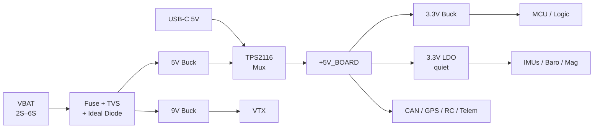

import PowerBudgetCalculator from '@site/src/components/PowerBudgetCalculator';

# Power System

## Architecture Overview

The 305ap uses a multi-rail power architecture with separate switching and linear regulators for different subsystems. There are no power enable/disable GPIOs. All sensors, peripherals, and logic are powered whenever the board receives input power.



## Input Protection

The VBAT input path includes a full protection chain:

| Component | Part | Function |
|---|---|---|
| VBAT fuse | Littelfuse 0437007.WR | 7 A fast-blow VBAT overcurrent protection |
| USB fuse | Littelfuse 0466002.NRHF | 2 A fast-blow USB input protection |
| TVS diode | SMAJ30CA | Transient voltage suppression |
| Ideal diode controller | LM74700-Q1 | Reverse-polarity protection, low-loss switching |
| External N-FET | AON7246E | Main pass element (60 V, low RDS(on)) |

**Fuse: Littelfuse 0437007.WR**

| Parameter | Value |
|---|---|
| Rated current | 7 A |
| Voltage rating (DC) | 35 V |
| Response | Fast-blow |
| Breaking capacity | 50 A at rated voltage |
| Package | 1206 (3216 metric) |

The LM74700-Q1 uses a charge-pump drive to fully enhance the N-FET, achieving roughly 20 mV forward drop in normal operation versus the ~0.3–0.5 V of a Schottky. This keeps the board's own power consumption low and reduces heat dissipation on the input stage.

:::note Input voltage range
Supported input: **2S–6S LiPo / Li-ion** (approximately 7–25.2 V). Do not exceed the LM74700-Q1's 65 V absolute maximum.
:::

## Switching Regulators

All three switching rails use the **AP63357DV-7**, a 3.8–32 V, 3.5 A synchronous buck converter with integrated compensation and spread-spectrum EMI reduction.

| Rail | Nominal Output | Primary Loads |
|---|---|---|
| 9 V | 9 V | VTX connector, high-power accessories |
| 5 V | 5 V | CAN transceivers, GPS, RC connector, telemetry, TPS2116 input |
| 3.3 V | 3.3 V | MCU, digital peripherals, main logic rail |

## USB / Battery Power Mux

A **TPS2116** (1.6–5.5 V, 2.5 A) power multiplexer selects between:

- **5V_USB_SAFE** from the USB-C VBUS
- **5V_SWITCHER** from the onboard 5 V buck

The selected rail feeds the board's +5V net through a ferrite bead. This allows the board to operate from USB power alone on the bench without requiring battery power, and prevents backfeeding the USB host when battery power is also present.

## Sensor LDO (Quiet Rail)

The **RT9193-33GB** is a 300 mA ultra-low-noise CMOS LDO. It is powered from the 5 V rail through a ferrite bead for additional high-frequency isolation, and its output drives:

- Both ICM-45686 IMUs (analog supply)
- BMP581 barometer
- MMC5983MA magnetometer

This keeps switching noise from the main 3.3 V buck out of the sensor signal chain. All I/O-level signals for these sensors still reference the main 3.3 V digital rail.

## Voltage Sensing

| Signal | GPIO | ADC Channel | Divider | Notes |
|---|---|---|---|---|
| VSENSE (battery voltage) | PC4 | ADC1 INP4 | 1:11 (10 kΩ / 1 kΩ) | Buffered through TLV9002 op-amp |

At 16.8 V (4S full), the ADC sees approximately 1.527 V. PX4 applies the inverse ratio to report battery voltage.

**PX4 parameter:** `BAT1_V_DIV`: set to `11.0`.

To calibrate precisely, use a multimeter to measure actual battery voltage and adjust `BAT1_V_DIV` until QGC matches.

## Current Sensing

| Signal | GPIO | ADC Channel | Notes |
|---|---|---|---|
| ASENSE (current input) | PC3_C | ADC3 INP1 | Filtered + buffered through TLV9002 op-amp |

The 305ap **does not have an onboard current shunt**. The ASENSE input accepts a 0–3.3 V analog signal from an external current sensor, typically a power module or an ESC with analog current output.

**PX4 parameter:** `BAT1_A_PER_V`: set per your external sensor's datasheet (amps per volt of output).

:::note No current data without external sensor
If nothing is connected to the current sense input, set `BAT1_A_PER_V` to `0` to avoid false current readings.
:::

The analog frontend (TLV9002 dual op-amp, RC filter) provides a low-impedance, filtered signal to the ADC for both voltage and current channels.

## Power Budget

Use the calculator below to estimate your total rail loading and battery current draw. Drag the sliders to match your connected accessories.

<PowerBudgetCalculator />

### System Limits

The 305ap's real-world current limits are set by the connector, fuse, and mux ratings, not the headline regulator numbers. The AP63357 bucks are 3.5 A devices, but the system limits are tighter:

| Bottleneck | Limit | Reason |
|---|---|---|
| VBAT input connector (CN1) | **3.0 A** continuous | 3 JST-GH power pins × 1.0 A/contact |
| VBAT fuse | 7.0 A | Littelfuse 0437007.WR |
| USB input fuse | 2.0 A | Littelfuse 0466002.NRHF |
| +5V_BOARD rail total | **2.5 A** absolute max | TPS2116 mux rating |
| Any single GH-powered accessory port | **1.0 A** | Single JST-GH contact per port |
| VTX 9 V connector | **1.0 A** | Single JST-GH contact |

The connector is the binding constraint on VBAT input. The TPS2116 mux is the binding constraint on the +5V rail, not the bucks. The "1 A per port" contact limit is also not additive. All ports combined share the 2.5 A mux ceiling.

### Onboard Power Consumption

The board itself draws relatively little. The STM32H743 dominates the budget. Sensor loads are negligible:

| Device | Typical | Source |
|---|---|---|
| STM32H743 | 175–264 mA @ 3.3 V | ST datasheet; real FC use (USB, SD, DMA, timers) best estimated at 150–250 mA |
| ICM-45686 × 2 | ~0.84 mA @ 3.3 V LDO | 0.42 mA each in 6-axis low-noise mode |
| MMC5983MA | ~0.45 mA @ 3.3 V LDO | Typical operating |
| BMP581 | ~0.26 mA @ 3.3 V LDO | ~260 µA at normal ODR |
| CAN PHYs, LEDs, misc | ~20–50 mA | Estimated |
| **Board-only typical** | **~180–300 mA** | 3.3 V rail |
| **Board-only worst-case** | **~350–450 mA** | All peripherals active, heavy MCU load |

### Per-Port Current Guidance

| Connector | Typical | Recommended max | Hard ceiling |
|---|---|---|---|
| TELEM 1 / TELEM 2 | 150–350 mA | 500 mA | 1.0 A |
| Basic GPS | 80–200 mA | 300 mA | 1.0 A |
| CAN 1 / CAN 2 | 100–300 mA | 500 mA | 1.0 A |
| External I2C | 50–200 mA | 300 mA | 1.0 A |
| External SPI | 100–250 mA | 400 mA | 1.0 A |
| RC IN | 50–150 mA | 250 mA | 1.0 A |
| Motors (5 V pin) | 0–100 mA | 250 mA | 1.0 A |
| VTX (9 V pin) | 300–700 mA | 800 mA | 1.0 A |

:::warning 5V rail is shared
The 2.5 A mux ceiling applies to all +5V ports combined. Do not load multiple ports to their individual 1.0 A contact limits simultaneously.
:::

### Recommended System Totals

| Rail | Recommended combined | Absolute max |
|---|---|---|
| +5V accessories (all ports) | 1.5 A | 2.0 A |
| +9V accessories (VTX) | 0.5–0.8 A | 1.0 A |
| Total VBAT input with accessories | ~15 W | ~20–22 W |

**Estimating battery current draw:**

```
P_total = P_onboard + (5V × I_5V_accessories) + (9V × I_9V_accessories)
I_battery = P_total / (V_battery × η)
```

Use η = 0.85–0.90 as a planning estimate for the synchronous buck stages.

## Power Recommendations

- Use a regulated power module with current sense output between your battery and the FC
- Connect the power module's current output to the ASENSE pin on the motors connector (consult your module's datasheet for scaling, then set `BAT1_A_PER_V` accordingly)
- The 9 V rail on the VTX connector is available for video transmitter power (800 mA recommended max)
